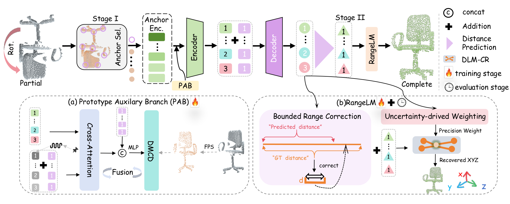
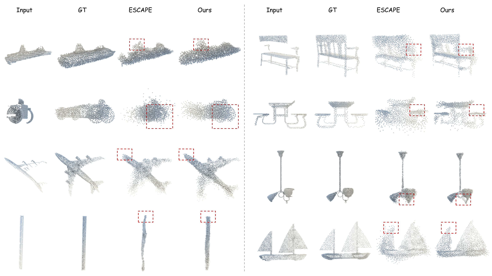

<div align="center">

# PA-RangeLM

### Prototype-Guided Differentiable Range Optimization for Rotation-Robust Geometric Reconstruction

**Rotation-robust point cloud completion directly in the observed frame.**<br>
A training-only prototype branch supplies complete-shape guidance, while uncertainty-aware range correction and differentiable coordinate recovery turn anchor distances into dense Cartesian geometry.

[](https://pa-rangelm.github.io/)
[](checkpoints/README.md)
[-334155?style=for-the-badge)](#evaluation)

</div>

> Anonymous research release. This branch contains the implementation and reproducibility materials without author names, affiliations, personal paths, experiment logs, or tracking identifiers.

## Highlights

| Rotated PCN | Result | Evaluation scope |
|:--|:--:|:--|
| Mean CD-L1 ×10³ (lower is better) | **10.20** | Complete 1,200-sample test split |
| End-to-end inference time | **0.534 s/sample** | Same reported runtime setting |
| Category comparison | **8/8 improved** | Versus the reproduced latest baseline (11.01 average) |

## Method overview

<div align="center">
  <a href="assets/readme/pa-rangelm-pipeline-original.pdf">
    
  </a>
  <br>
  <sub><b>PA-RangeLM architecture.</b> Click the figure to open the original full-resolution PDF.</sub>
</div>

PA-RangeLM separates representation learning from dense geometric recovery:

1. **Prototype-guided representation.** Stage I uses a training-only Prototype Auxiliary Branch to inject sparse complete-shape supervision into anchor-distance features.
2. **Bounded range correction.** Stage II refines predicted anchor distances while constraining the magnitude of each learned correction.
3. **Uncertainty-aware recovery.** Learned precision weights and a vectorized differentiable Levenberg-Marquardt solver recover dense XYZ coordinates in the observed frame.

## Qualitative results

<div align="center">
  <a href="assets/readme/qualitative-results-original.pdf">
    
  </a>
  <br>
  <sub><b>Main-paper visualization.</b> PCN examples are shown on the left and MVP examples on the right. This preview was rendered from the uncompressed original PDF; click it to inspect the source-resolution figure.</sub>
</div>

## Installation

The reference environment uses Python 3.8, PyTorch 1.11, and CUDA. Install the listed packages and a compatible PointNet++ operator package that exposes `pointnet2_ops`:

```bash
pip install -r requirements.txt
```

## Data preparation

Set the PCN dataset paths in `configs/pcn.yaml`. Dataset files are not distributed in this repository.

The main evaluation protocol applies deterministic, independently sampled SO(3) rotations to the complete 1,200-sample PCN test split with seed 2026. Each transform is applied jointly to the partial input, complete target, and anchors.

## Evaluation

Download `pa_rangelm_pcn_rotated_10p20.pth` as described in [`checkpoints/README.md`](checkpoints/README.md), then run:

```bash
MODEL_PATH=/path/to/pa_rangelm_pcn_rotated_10p20.pth \
  bash scripts/test_pcn_rotated.sh
```

The script evaluates eight anchors and at most 80 iterations of the vectorized differentiable coordinate-recovery solver. The reported full-test result is **CD-L1 = 10.20 ×10³** (lower is better).

Additional evaluation entry points are provided for standard-pose PCN, Haar-uniform SO(3), MVP transfer, KITTI, and uncertainty analysis:

```bash
bash scripts/test_pcn_standard.sh
bash scripts/test_pcn_haar_so3.sh
bash scripts/test_mvp_unseen.sh
bash scripts/test_kitti.sh
bash scripts/test_uncertainty.sh
```

## Training

Training follows the two-stage design shown above:

```bash
bash scripts/train_stage1.sh
bash scripts/train_stage2.sh
```

- **Stage I** learns the shared representation with the training-only prototype branch.
- **Stage II** freezes the Stage-I trunk and optimizes the dense decoder, bounded range-correction head, uncertainty head, and coordinate-recovery path.

The `configs/` and `scripts/` directories also include the component-ablation settings used in the release. Optional experiment tracking remains disabled unless it is explicitly enabled from the command line.

## Repository structure

```text
configs/          Training, evaluation, and ablation configurations
datasets/         PCN and MVP data loaders and transforms
loss_functions/   Reconstruction objectives
models/           PA-RangeLM model components
scripts/          Reproducible training and evaluation entry points
utils/            Optimization, solver, and training utilities
evaluate_*.py     Dataset-specific evaluation programs
train.py          Two-stage training entry point
```

## Reproducibility note

The numerical claims in this release are limited to the stated datasets, checkpoints, rotation protocols, and evaluation settings. No dataset or third-party source tree is bundled with the anonymous code.
